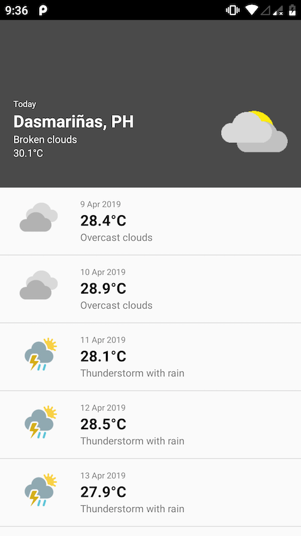
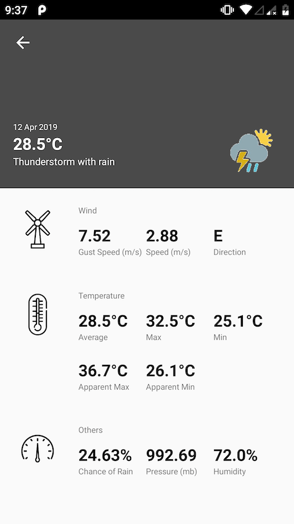

# Android Tech Task

## The Task
- Create an app that displays weather forecasts for the next 10 days
- Use any weather API of choice
- Today's weather should be highlighted at the top
- A details screen should open when an item is clicked

## Screenshots
Home

Day Details

## Notes
- Used Model-View-Presenter as application architecture
- Used Retrofit to connect to weatherbit.io API
- Used a RecyclerView instead of a ListView
- Used Google Play Services Location Service to get the phone's current location
- Wrote unit tests using JUnit and UI tests with Espresso
- Handled system location permissions requirements
